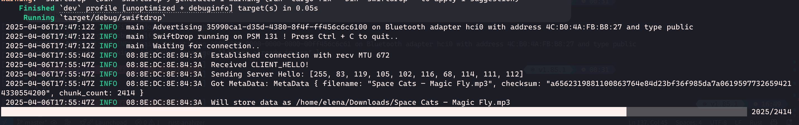

# SwiftDrop

SwiftDrop is a small utility in the spirit of AirDrop. It uses L2CAP to receive files from another device and stores them in the Downloads folder.  
The protocol used is very primitive and probably not very robust but it works for now.  

Currently swiftdrop is only tested on Linux with an iOS device being the sender of data.  

## Usage

Clone the repository and build & run :)

```sh
git clone https://github.com/theswiftfox/swiftDrop.git
cargo run --release
```

  

## Wishlist for the future

- bundling as app that can run in the background with a tray icon or something tracking received files  
- implement the other direction as well (pc -> phone)  
- improve speed of transfers (and maybe extend to using wifi for larger files)  
 